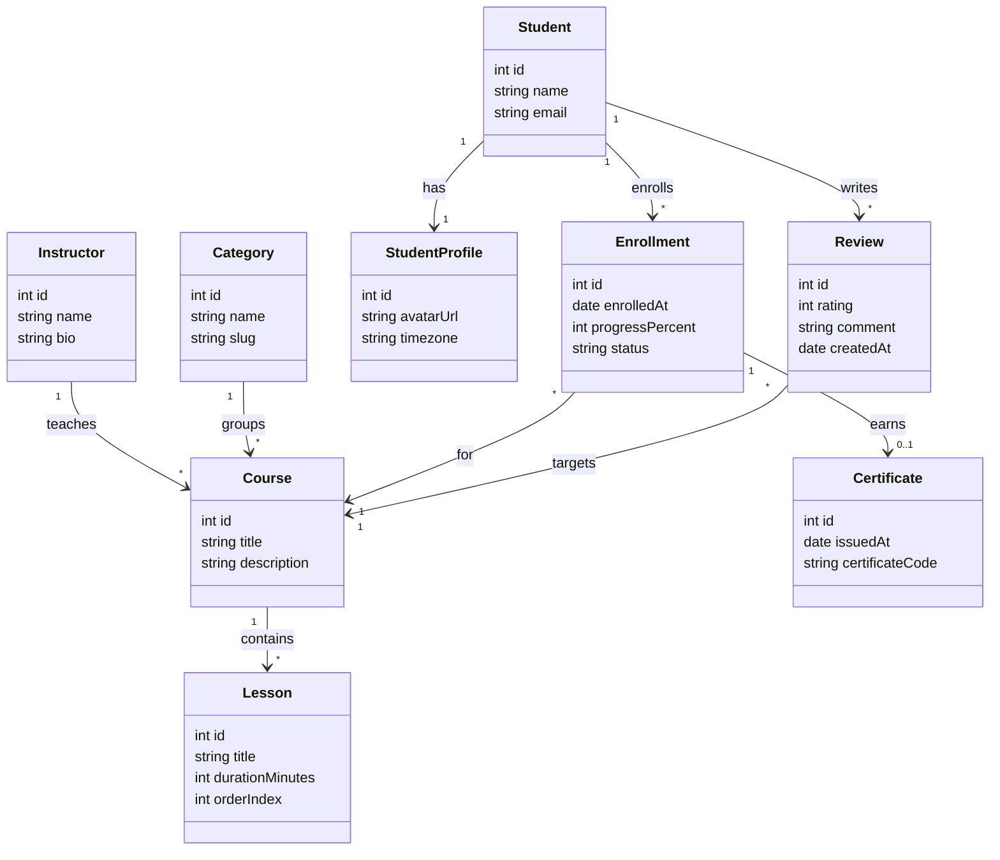

# 12 - Modelo final

Version en ingles: [README.md](./README.md)

## Felicidades

Terminaste la **Practica 2**. Compara tu modelo en [diagram.4geeks.com](https://diagram.4geeks.com/) con la referencia de abajo. El diseno y las etiquetas exactas pueden variar; enfocate en **entidades**, **propiedades tipadas** y **texto de cardinalidad** en los enlaces.

Marca esta practica LearnPack como **completada** cuando estes conforme con tu diagrama.

## Solucion de referencia (Mermaid)

Una representacion valida de la plataforma de cursos de los pasos 01–11:

## Resumen de relaciones

| Desde | Hacia | Tipo | Notas |
|-------|-------|------|-------|
| `Instructor` | `Course` | 1:N | Un instructor, muchos cursos |
| `Course` | `Lesson` | 1:N | Contenido ordenado |
| `Category` | `Course` | 1:N | Agrupacion del catalogo |
| `Student` | `StudentProfile` | 1:1 | Perfil extendido |
| `Student` | `Course` | N:M | Mediante `Enrollment` |
| `Enrollment` | `Certificate` | 1:0..1 | Al completar |
| `Student` | `Course` | N:M | Mediante `Review` |

## Que hacer despues

- Exporta un PNG desde diagram.4geeks.com para tu portafolio si quieres.

## Preguntas de reflexion

1. ¿Deberia `status` en `Enrollment` ser una clase `EnrollmentStatus` aparte, o basta `string` en esta etapa?
2. Si los cursos tuvieran **varios instructores**, ¿como cambiarias las etiquetas del enlace `Instructor`–`Course`?
3. ¿Por que modelar `Review` como clase propia en lugar de guardar `rating` directamente en `Enrollment`?
