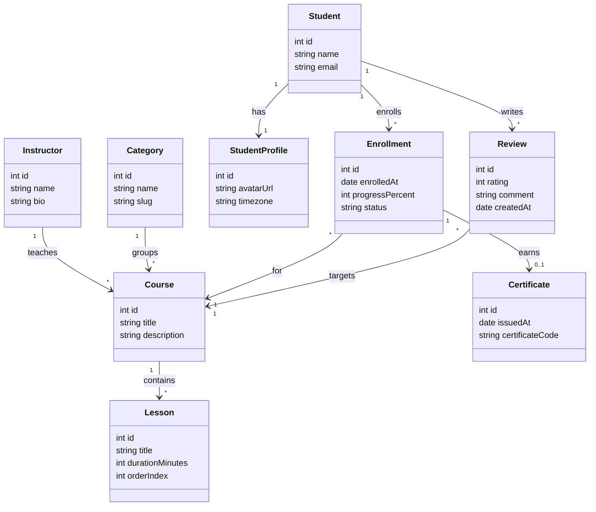

# 12 - Final Model

Spanish version: [README.es.md](./README.es.md)

## Congratulations

You finished **Práctica 2**. Compare your [diagram.4geeks.com](https://diagram.4geeks.com/) model with the reference below. Layout and exact labels may differ; focus on **entities**, **typed properties**, and **cardinality text** on links.

Mark this LearnPack practice as **complete** when you are satisfied with your diagram.

## Reference solution (Mermaid)

One valid representation of the online course platform from steps 01–11:

## Relationship summary

| From | To | Type | Notes |
|------|-----|------|-------|
| `Instructor` | `Course` | 1:N | One instructor, many courses |
| `Course` | `Lesson` | 1:N | Ordered content |
| `Category` | `Course` | 1:N | Catalog grouping |
| `Student` | `StudentProfile` | 1:1 | Extended profile |
| `Student` | `Course` | N:M | Through `Enrollment` |
| `Enrollment` | `Certificate` | 1:0..1 | Issued when completed |
| `Student` | `Course` | N:M | Through `Review` |

## What to do next

- Export a PNG from diagram.4geeks.com for your portfolio if you want.

## Discussion questions

1. Should `status` on `Enrollment` be a separate `EnrollmentStatus` class, or is `string` enough at this stage?
2. If courses could have **multiple instructors**, how would you change the `Instructor`–`Course` link labels?
3. Why model `Review` as its own class instead of storing `rating` directly on `Enrollment`?
